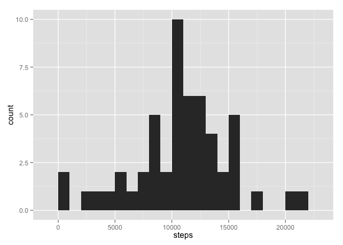
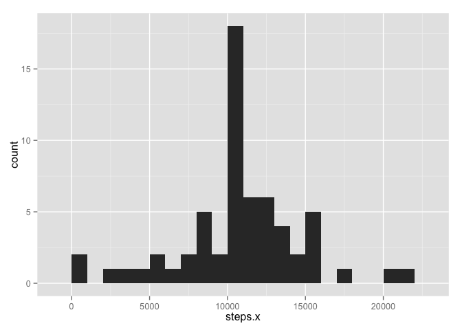

# Reproducible Research: Peer Assessment 1


## Loading and preprocessing the data
First, set the working directory:

```r
setwd("~/Desktop/Coursera/repdata/RepData_PeerAssessment1")
```

Second, load the activity data from activity.csv while accounting for the header:

```r
raw_data <- data.frame(read.csv('activity.csv', header =TRUE, na.strings='NA'))
colnames(raw_data) <- c("steps","date","interval")
raw_data$date <- as.Date(raw_data$date)
```

Create "Data" from raw_data omitting NA:

```r
data <- na.omit(raw_data)
```

Some of the questions below requre an aggregrate daily count of steps, so let's go ahead and create that:

```r
data_daily <- aggregate(steps ~ date, data, sum)
```

Some other questions below requre an aggregrate interval count of steps, so let's go ahead and create that, too:

```r
data_interval <- aggregate(steps ~ interval, data, mean)
```

## What is mean total number of steps taken per day?
Using ggplot2, create a histogram graph of total steps by day:

(Please note, this graph may not look exactly like other coursemates graphs as it was created in ggplot, one of the three allowed plotting system in the instructions. Bins set at 1000 as there's a lot of variation in steps on the daily basis.)

```r
library('ggplot2')
qplot(steps, data=data_daily, geom="histogram",binwidth = 1000)
```

 

Calculate the mean of steps:

```r
mean(data_daily$steps)
```

```
## [1] 10766.19
```

Calculate the median of steps:

```r
median(data_daily$steps)
```

```
## [1] 10765
```
## What is the average daily activity pattern?
Using ggplot2, create a line graph of average steps by interval:

(Please note, this graph may not look exactly like other coursemates graphs as it was created in ggplot, one of the three allowed plotting system in the instructions.)

```r
qplot(interval, steps, data=data_interval, geom="line")
```

 

Which 5-minute interval, on average across all the days in the dataset, contains the maximum number of steps?

```r
(data_interval[ order(-data_interval$steps),1])[1]
```

```
## [1] 835
```

## Imputing missing values
If steps is NA, use the interval average created above and create a histogram of the new daily averages. I picked the interval average ove daily total average as many of the NA's are located in times of little activity.

```r
data_imputed <- merge(raw_data, data_interval, by="interval", all.y=TRUE)
for (i in 1:length(data_imputed$steps.x)) {
        if (is.na(data_imputed$steps.x[i])) {
                data_imputed$steps.x[i] <- data_imputed$steps.y[i]
        }
}
qplot(steps.x, data=aggregate(steps.x ~ date, data_imputed, sum), geom="histogram",binwidth = 1000)
```

 

Calculate the new mean of steps:

```r
data_imputed_daily <-aggregate(steps.x ~ date, data_imputed, sum)
# If you happen to read this comment, could you please mention so in the evaluation comments. 
mean(data_imputed_daily$steps.x)
```

```
## [1] 10766.19
```

Calculate the new median of steps:

```r
median(data_imputed_daily$steps.x)
```

```
## [1] 10766.19
```
 The new means and medians don't differ drasticly.
 
## Are there differences in activity patterns between weekdays and weekends?
I was unable to complete this problem in the alloted time. 

This missing question should affect only the question:
Does the report contain a panel plot comparing the average number of steps taken per 5-minute interval across weekdays and weekends?


